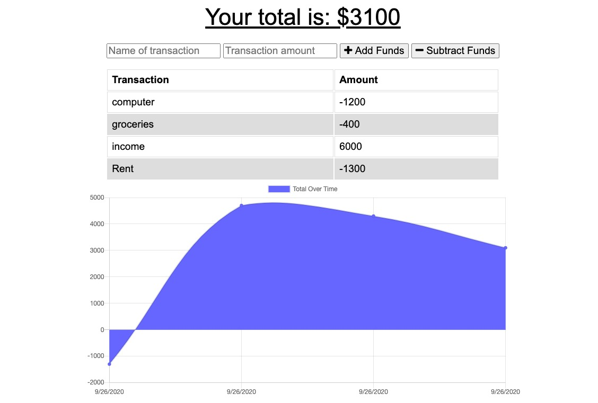

# Budget-Tracker
A budget tracking application that uses offline functionality.

## Table of contents
* [General info](#general-info)
* [Deployed Link](#deployed_link)
* [Screenshots](#screenshots)
* [Setup](#setup)
* [Code](#code)
* [Licenses](#licenses)
* [Inspiration](#inspiration)
* [Contact](#contact)

## General info
This application allows you to track your transactions and help plan a budget. The data that is entered offline will be cached and uploaded when a connection is established.

## Deployed Link
[Budget Tracker](https://powerful-badlands-42229.herokuapp.com/)

## Screenshots

## Setup
* Clone GitHub repository 
* run npm install
* run npm i mongoose
* run npm i compression
* run npm i express
* run npm i lite-server
* run npm i morgan

* Run 'npm start' to enter the application.

## Code and Technologies
* HTML 
* CSS
* Bootstrap
* JavaScript
* Node.js
* Express.js

* Indexed DB for offline
* Social Worker installed and activated

## Licenses
* MIT license
* ISC

## Inspiration
Learn to cache project data for offline usability. The code base was developed by another user and cloned. Offline functionality was developed by Alex Chigas. 

## Contact
* Alex Chigas (Achigas)

